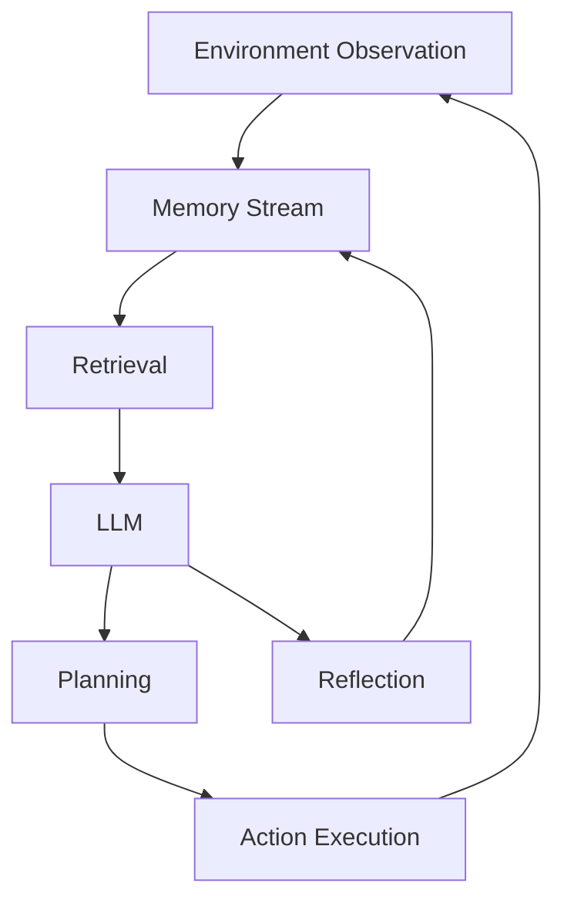
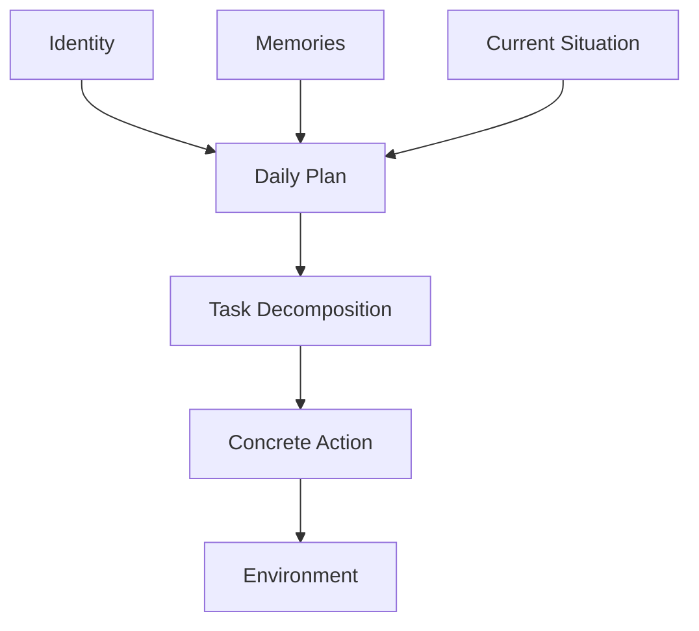

## 论文信息
- 标题：**Generative Agents: Interactive Simulacra of Human Behavior**
- 作者：Joon Sung Park, Joseph C. O’Brien, Carrie J. Cai, Meredith Ringel Morris, Percy Liang, Michael S. Bernstein
- 会议：UIST 2023
- DOI：[https://doi.org/10.1145/3586183.3606763](https://doi.org/10.1145/3586183.3606763)
## 一句话总结
本文提出了第一个真正意义上具有**长期记忆（Long-term Memory）+反思（Reflection）+规划（Planning）**能力的LLM Agent架构，使多个Agent能够在开放世界中形成持续、自洽且具有社会性的行为模式。后续几乎所有Agent框架（AutoGPT、Voyager、CAMEL、MetaGPT、AgentVerse、SWE-Agent等）都不同程度继承了其设计思想。
# 1. 研究背景与前置工作
## 传统NPC与行为模拟
过去几十年中，人们一直希望构建能够模拟真实人类行为的计算代理：
- The Sims
- NPC系统
- Cognitive Modeling
- Social Simulation
- Virtual Human
问题在于：
- 行为规则需要手工编写
- 难以扩展
- 无法长期保持人格一致性
- 无法形成复杂社会行为
## 大语言模型的发展
GPT系列模型出现后：
LLM已经具备：
- 对话能力
- 推理能力
- 人物角色扮演能力
但仍存在明显问题：
### 缺乏长期记忆
例如：
昨天认识的人
今天就忘了
```

### 缺乏持续人格

```text
上午说喜欢A
下午又喜欢B
```

### 缺乏长期规划

LLM只能生成：

```text
下一句话
```

而不能生成：

```text
未来一天
未来一周
未来一个月
```

的行为逻辑。

因此作者提出：

> 如何让LLM Agent像人一样记忆、反思、规划？

# 2. 核心贡献

本文提出三大模块：

1. Memory Stream
    
2. Reflection
    
3. Planning
    

共同组成 Generative Agent Architecture。

## 总体架构



形成闭环：

```text
观察
→ 存储
→ 检索
→ 推理
→ 规划
→ 行动
→ 再观察
```

# 3. Memory Stream

## 设计目标

让Agent拥有类似人类的经历记录。

所有事件都会被写入：

```text
时间戳
+
自然语言描述
```

例如：

```text
8:00
Klaus ate breakfast.
```

```text
9:00
Klaus met Maria.
```

```text
10:00
Maria discussed research with Klaus.
```

这些形成持续增长的记忆流：

```text
Memory Stream
```

## Memory Object

每条记忆包含：

```text
description
timestamp
importance
embedding
```

# 4. Retrieval机制

## 核心问题

Memory越来越大：

```text
100条
1000条
10000条
```

LLM无法全部放入Context。

因此需要检索。

## Retrieval三要素

作者提出：

```text
Recency
+
Importance
+
Relevance
```

### 1. Recency

最近发生的事情更重要。

采用指数衰减：

[  
Recency(d)=\lambda^d  
]

其中：

- (d)：距离当前时间的小时数
    
- (\lambda=0.995)
    

---

### 2. Importance

记忆的重要程度。

由LLM打分：

Prompt：

```text
On the scale of 1 to 10,
rate the likely poignancy
of the memory.
```

例如：

```text
cleaning room → 2
```

```text
asking crush out → 8
```

记为：

[  
Importance \in [1,10]  
]

---

### 3. Relevance

当前任务与记忆的相关程度。

利用Embedding：

# [  
Relevance

\cos(e_q,e_m)  
]

其中：

- (e_q)：当前查询Embedding
    
- (e_m)：记忆Embedding
    

# 5. 检索评分公式（论文关键公式）

所有分数先归一化到：

[  
[0,1]  
]

最终得分：

[  
Score=  
\alpha_r \cdot Recency  
+  
\alpha_i \cdot Importance  
+  
\alpha_{rel}\cdot Relevance  
]

论文实现：

# [  
\alpha_r

# \alpha_i

# \alpha_{rel}

1  
]

即：

[  
Score=  
Recency  
+  
Importance  
+  
Relevance  
]

然后选择Top-K记忆进入Context。

这是论文最重要的数学设计之一。

# 6. Reflection（反思机制）

## 为什么需要Reflection

仅靠记忆无法形成抽象认知。

例如：

记忆：

```text
Maria经常做研究
```

```text
Maria经常讨论论文
```

```text
Maria经常加班
```

人会推断：

```text
Maria热爱科研
```

但普通LLM不会自动形成这种高层概念。

## Reflection机制

Agent周期性地对记忆进行总结。

形成：

```text
高层认知
```

例如：

```text
Maria is passionate about research.
```

这种内容重新写回Memory。

## Reflection流程


## Reflection触发条件

作者设计：

当近期记忆重要度总和超过阈值：

[  
\sum Importance > 150  
]

时触发Reflection。

实验中：

```text
每天约2~3次
```

# 7. Planning机制

## 核心思想

人类不会每分钟重新规划人生。

而是：

```text
长期计划
↓
中期计划
↓
短期行动
```

作者采用层级规划。

## 第一层：日计划

例如：

```text
7:00 起床
8:00 早餐
9:00 工作
12:00 午餐
```

## 第二层：任务分解

例如：

```text
准备早餐
```

分解为：

```text
走向厨房
拿鸡蛋
开火
做饭
```

## 第三层：行动执行

Agent每分钟执行一次动作。

## Planning结构



# 8. 社会行为生成机制

Agent之间通过自然语言互动。

形成：

```text
信息传播
关系建立
协同行动
```

## 情人节实验

研究者只给出一个种子事件：

```text
Isabella wants to host
a Valentine's Day party.
```

没有任何额外脚本。

随后Agent自主完成：

### 信息传播

```text
邀请朋友
```

### 关系发展

```text
认识新人
```

### 情感互动

```text
约会
```

### 协调行为

```text
准时参加聚会
```

这成为论文最著名的案例。

# 9. 实验设计

## 实验环境

类似：

```text
The Sims
```

的小镇。

包含：

```text
25个Agent
```

每个Agent具有：

- 姓名
    
- 职业
    
- 住所
    
- 性格
    
- 关系网络
    

## 评价内容

### Individual Believability

个体可信度

### Social Emergence

社会涌现能力

### Long-Term Coherence

长期一致性

# 10. 消融实验

作者去掉不同模块。

## 去掉Memory

结果：

```text
Agent经常遗忘
```

表现：

- 不记得朋友
    
- 不记得约定
    

---

## 去掉Reflection

结果：

```text
无法形成高层认知
```

表现：

- 行为机械
    
- 缺少人格成长
    

---

## 去掉Planning

结果：

```text
行动混乱
```

表现：

- 时间安排不合理
    
- 长期目标消失
    

## 结论

三个模块缺一不可：

```text
Memory
+
Reflection
+
Planning
```

共同决定Agent可信度。

# 11. 论文启示

## 启示1：Agent核心不在模型

本文最重要观点：

```text
Agent能力
≠
LLM能力
```

而是：

```text
LLM
+
Memory
+
Reflection
+
Planning
```

# 启示2：长期记忆比Prompt更重要

Agent真正的智能来源于：

```text
持续积累经验
```

而非一次Prompt。

# 启示3：Reflection是形成人格的关键

Reflection使Agent获得：

```text
自我认知
```

以及：

```text
对他人的认知
```

这是后续Agent研究的重要方向。

# 启示4：Agent Society成为可能

多个Agent通过记忆与交流形成：

```text
Emergent Behavior
```

即：

```text
群体智能
```

这是后续：

- AgentVerse
    
- CAMEL
    
- MetaGPT
    
- AutoGen
    
- AI Town
    
- Stanford Smallville
    

等工作的基础。

# 12. 局限性

## 成本高

大量调用LLM：

```text
观察
检索
反思
规划
```

均需推理成本。

## 幻觉问题

错误记忆可能持续传播。

## 社会行为规模有限

实验仅：

```text
25 Agents
```

尚未验证更大规模社会。

## 缺乏真实世界反馈

主要运行于Sandbox环境。

# 13. 核心结论

Generative Agents首次提出了一套完整的Agent认知架构：

```text
Memory Stream
      ↓
 Retrieval
      ↓
 Reflection
      ↓
 Planning
      ↓
 Action
```

其中最关键的创新包括：

1. 长期自然语言记忆流（Memory Stream）
    
2. Recency + Importance + Relevance检索机制
    
3. Reflection高层认知生成机制
    
4. Hierarchical Planning层级规划机制
    
5. 多Agent社会涌现能力
    

它奠定了现代LLM Agent研究的基础，是Agent领域最具影响力的开创性论文之一。

**You've experienced ScholarGPT — now meet what's next.**  
_Scholar Deep Research Agent_ elevates your research game with:  
🔍 350M+ trusted papers from top academic publishers, updated hourly.  
🧠 Advanced multiple AI models dig through millions of sources for pinpoint insights, fast.  
📝 Auto-generated highlights, smart notes, and visual reports  
📁 All saved directly to your AI-powered knowledge base  
ScholarGPT helped you search. Now, transform how you think.  
[Explore Scholar Deep Research](https://bit.ly/43rXgSx)