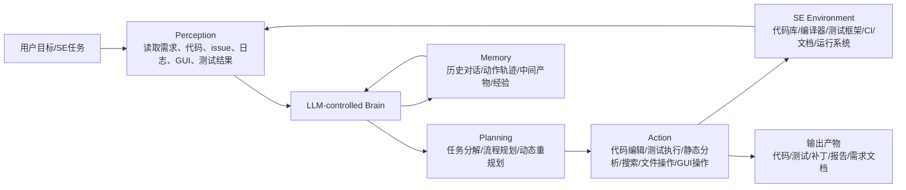
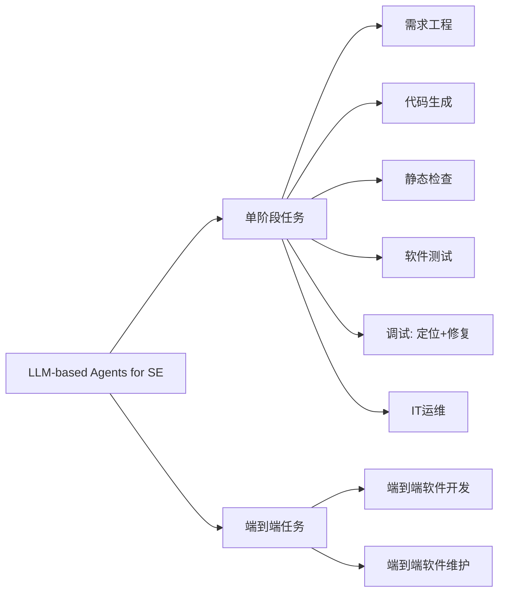
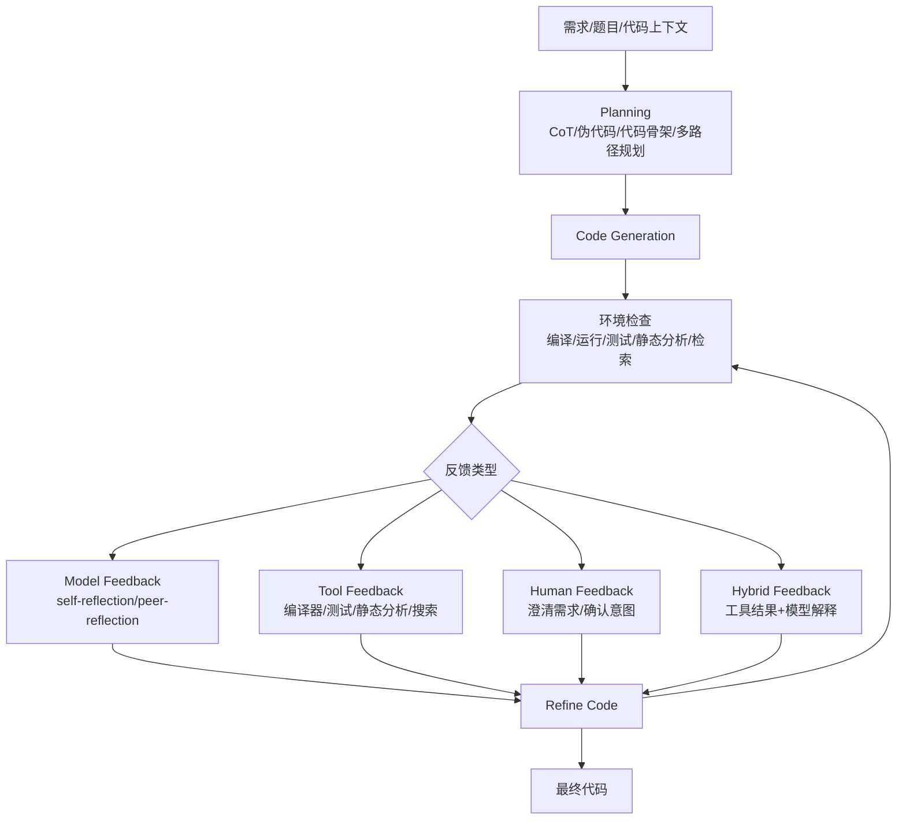
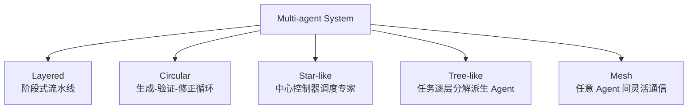

> 论文类型：综述。本文不提出单一新模型，而是系统整理 **LLM-based Agent 在软件工程中的应用与架构分类**。作者收集 124 篇相关论文，从 **SE 任务视角** 与 **Agent 架构视角** 两条线进行分类，并讨论挑战与未来方向。
## 1. 论文要解决的问题
传统 standalone LLM 已被用于代码生成、测试、调试、程序修复等 SE 任务，但它通常只能进行一次性文本输入输出，缺乏对动态环境的持续感知、工具调用、计划修正与长期记忆能力。软件工程任务往往具有复杂性、需求变化、迭代开发、多人协作等特点，因此需要能够“感知环境—制定计划—执行动作—接收反馈—迭代修正”的 Agent 系统。本文试图回答：现有 LLM-based Agents 如何被用于软件工程？它们在不同 SE 任务中采用了什么架构？哪些设计真正有效？还有哪些开放问题？
## 2. 前置工作
### 2.1 LLM for SE
已有综述表明，LLM 已经被广泛用于程序生成、软件测试、调试、程序改进等任务。但 standalone LLM 在真实 SE 场景中容易受限于幻觉、上下文不足、缺少环境反馈、无法调用外部工具、难以处理端到端任务。
### 2.2 AI Agent 与 LLM-based Agent
AI Agent 指能够自主感知环境并采取行动以实现目标的人工实体。早期 Agent 可基于符号逻辑或强化学习；LLM 出现后，LLM 被用作 Agent 的中央控制器，由此形成 LLM-based Agent。相比 standalone LLM，它额外强调外部资源感知、工具调用、多 Agent 协作、人类反馈与迭代执行。
### 2.3 软件工程任务的特殊性
软件工程生命周期包含需求工程、设计、编码、静态检查、测试、维护等阶段。其核心难点包括：系统复杂、需求不断变化、开发过程高度迭代、涉及多人协作。因此 Agent 的 planning、memory、perception、action 与 multi-agent collaboration 天然对应这些 SE 难点。
## 3. 调研方法
作者将范围限定为“使用或增强 LLM-based Agent 来解决 SE 任务，并包含 SE 任务评估”的论文。排除仅讨论未来设想、无评估、非 LLM Agent、单线性 LLM workflow、灰色文献、重复版本等。检索过程包括 DBLP 关键词检索、前向/后向滚雪球、作者反馈三步：DBLP 初始命中 10,362 篇，人工筛选得到 67 篇；滚雪球加入 41 篇；作者反馈后最终纳入 124 篇，其中约 75% 为同行评审论文。  
检索式核心形式：  
`("agent" OR "llm" OR "language model") AND ("api" OR "bug" OR "code" OR "coding" OR "debug" OR "defect" OR "deploy" OR "evolution" OR "fault" OR "fix" OR "maintenance" OR "program" OR "refactor" OR "repair" OR "requirement" OR "software" OR "test" OR "verification" OR "vulnerab")`
## 4. 总体分类
### 4.1 SE 任务视角

|任务类别|论文数量|主要目标|
|---|--:|---|
|Requirements Engineering|4|需求获取、建模、协商、规格化、验证|
|Code Generation|43|从需求或上下文生成代码，并迭代修正|
|Static Code Checking|14|漏洞检测、静态缺陷检测、代码审查|
|Testing|22|单元测试、系统测试、GUI 测试、模糊测试等|
|Fault Localization|2|定位错误代码元素|
|Repair|8|生成并验证补丁|
|IT Operations|3|根因分析、告警诊断、运维自动化|
|End-to-end Software Development|20|从需求到代码、测试、文档的完整开发|
|End-to-end Software Maintenance|9|从 issue 到定位、修复、验证的完整维护|

### 4.2 Agent 架构视角
本文按 planning、memory、perception、action、foundation LLM、multi-agent role、collaboration mechanism、information flow、human-agent collaboration 等维度整理 Agent 设计。其核心结论是：SE Agent 的关键不只是“让 LLM 写代码”，而是把 LLM 放进一个可交互、可调用工具、可迭代、可协作的工程系统中。
## 5. 关键架构总结
### 5.1 LLM-based Agent 基本框架

### 5.2 SE 生命周期中的 Agent 分布

### 5.3 代码生成中的 plan-generate-refine 框架

## 6. 按任务总结
### 6.1 Requirements Engineering
现有 RE Agent 主要利用多 Agent 角色扮演模拟用户、需求工程师、建模者、检查者、文档编写者等角色，覆盖需求获取、建模、协商、规格化、验证等阶段。代表性工作包括 Elicitron、SpecGen、Arora et al.、MARE。SpecGen 是工具增强单 Agent，结合 OpenJML 迭代生成 JML 规格，优于纯 LLM 与传统规格生成工具。主要挑战是：生成需求可能模糊、无关或错误；领域知识融入不足；过度用 Agent 替代真实 stakeholder；几乎没有支持需求演化的机制。
### 6.2 Code Generation
代码生成是论文最多的方向。核心范式是把一次性生成改造成 `plan-generate-refine`。Planning 可分为 prompt engineering strategy 与 agentic strategy：前者如 zero-shot/few-shot CoT，通用但通常只做一次性规划；后者根据历史动作和环境反馈动态修改计划，更适合复杂任务。迭代反馈分为 model feedback、tool feedback、human feedback、hybrid feedback。实证上，额外自然语言反馈可带来 2–17% 的绝对性能提升；但常见失败包括多 Agent 协作失控、测试质量低、错误反馈级联、长上下文推理退化。
### 6.3 Static Code Checking
静态检查包括静态缺陷/漏洞检测与代码审查。漏洞检测 Agent 通常包含 detector、validator、ranker、reporter 等角色，并结合 CodeQL、UBITect、tree-sitter、Z3 等工具。GPTLens 在 13 个真实智能合约上达到 76.9% 的漏洞检测成功率。代码审查 Agent 则模拟人类 peer review 流程，用多个 reviewer 或 reviewer-coder 循环完成分析、修正和文档化。主要挑战是工具集成较浅、LLM 对中间表示生成和代码推理要求高、误报过滤机制不足。
### 6.4 Testing
测试 Agent 主要用于单元测试与系统测试。单元测试 Agent 通常遵循 `generate-verify-fix`：先生成测试，再利用编译/执行错误、覆盖率、mutation testing 等反馈修正。系统测试覆盖 OS kernel、compiler、mobile app、web app、universal fuzzing、penetration testing 等场景。测试任务的主要难点是环境复杂、测试目标可能依赖项目级上下文、传统测试工具尚未与 Agent 深度融合、现有 Agent 往往只优化单一目标而难以同时优化可执行性、覆盖率和缺陷发现能力。
### 6.5 Debugging
调试包含 fault localization、program repair 与 unified debugging。Fault localization Agent 通过静态分析、仓库检索、运行信息辅助定位 bug；program repair Agent 生成候选补丁后用编译、执行、测试结果迭代修正；unified debugging 则把定位与修复双向耦合。FixAgent 包含 Localizer、Repairer、Crafter、Revisitor 等角色，模拟“橡皮鸭调试”；LDB 进一步利用代码块级运行状态分析。挑战包括过度依赖失败测试、工具反馈与 LLM 推理耦合不足、多 Agent 成本高、补丁语义正确性仍常需人工验证。
### 6.6 IT Operations
Ops Agent 处理告警诊断、根因分析和系统运维。典型流程是 controller 收到异常告警后分派 expert agents，专家 Agent 调用日志、指标、代码、文档等工具探索根因，最后形成诊断报告。现有策略包括 self-consistency with embedding voting、agent chain with blockchain-inspired voting、tree search with majority voting。挑战在于多维系统信号复杂、Agent 调度和信息整合困难、真实环境交互成本和风险高。
### 6.7 End-to-end Software Development
端到端软件开发 Agent 试图从需求出发，完成需求分析、架构设计、代码生成、测试、文档等全过程。多数系统采用类 Waterfall 或 Agile 的流程，并设置 manager、requirement engineer、designer、developer、tester、reviewer 等角色。协作方式主要分为 vertical architecture 与 vertical+horizontal architecture：前者由上游产物传给下游角色，后者在部分阶段引入平等讨论。挑战是当前系统仍多为线性瀑布式流程，缺少真实迭代演化；语言和应用域集中在 Python/简单 Web；评测 benchmark 与真实软件项目差距较大。
### 6.8 End-to-end Software Maintenance
端到端维护 Agent 面向真实 issue resolution，通常包括 preprocessing、issue reproduction、issue localization、task decomposition、patch generation、patch verification、patch ranking。SWE-bench Lite 上，DEIBase、SpecRover、MASAI、CodeR、Agentless 等方法表现较好；作者观察到：纯自主定位不一定更好，动态补丁验证与 patch ranking 通常提升 resolve rate，传统 fault localization pipeline 甚至可能超过复杂全自主 Agent。主要挑战是 issue 描述常非结构化且可能含截图/链接，issue reproduction 不可靠，patch verification 仍不足以保证语义正确。
## 7. Agent 组件分类
### 7.1 Planning
Planning 可按 planner 数量、规划轮数、路径数量、表示形式分类。单 planner 成本低但易幻觉；多 planner 可相互纠错但 token 与时间开销高。单轮规划适合流程清晰任务，多轮规划适合 ReAct 式环境反馈任务。计划表示包括自然语言、半结构化形式、图结构、伪代码、代码骨架等。
### 7.2 Memory
Memory 按持续时间分为 short-term memory 与 long-term memory。短期记忆保存当前任务的对话、action-observation-critique 轨迹、中间产物；长期记忆保存历史任务经验、压缩轨迹、可复用 shortcut。按所有权可分为 agent-private memory 与 shared memory；按格式可分为自然语言、结构化消息、代码、图像等。
### 7.3 Perception
SE Agent 主要感知文本与视觉信息。文本包括自然语言需求、issue、文档、日志、代码上下文；视觉主要用于 GUI 测试、移动应用测试、UI 状态理解。视觉输入可以补充 view hierarchy 的结构语义缺失，但通常仍需与文本信息结合。
### 7.4 Action
Action 主要体现为工具调用。工具类别包括 web/local retrieval、文件操作、GUI 操作、静态程序分析、动态分析、测试工具、fault localization 工具、version control 工具等。工具让 Agent 从“会说”扩展到“能查、能改、能跑、能测、能验证”。
### 7.5 Foundation LLM
Agent 对基础模型的要求包括指令跟随、多轮对话、规划、工具使用、长上下文、多步推理等。端到端维护 Agent 多依赖 GPT-4、GPT-4o、Claude-3.5-Sonnet 等强模型。作者强调：Agent 架构能增强基础模型，但无法完全弥补基础模型能力差距。
## 8. Multi-agent 系统
### 8.1 角色类型
常见角色包括 manager、requirements engineer、designer、developer、code reviewer、tester、debugger、deployment role、assistant role。Manager 负责规划、任务拆解、决策与调度；developer 负责编码；QA roles 负责审查、测试、调试；assistant roles 负责检索、报告、排序、规格生成等辅助任务。
### 8.2 协作结构

Layered 适合软件开发流水线；Circular 适合代码生成、修复、测试中的反馈循环；Star-like 适合 controller-expert 结构；Tree-like 适合动态任务分解；Mesh 灵活但管理复杂。信息流可分为 unidirectional transfer 与 bidirectional chat，前者更易解耦，后者更适合讨论和协商。
### 8.3 Human-agent Collaboration
人类参与主要出现在 planning、requirements、development、evaluation 四个阶段。人类可修改 workflow、澄清需求、编辑中间代码、评估输出。论文指出，在某些任务中，人类提供简短 oracle plan 的 human-AI collaboration 能超过纯 AI feedback-based 方法。
## 9. 实验结果与调研发现
本文本身不做新的实验，而是总结已有工作的评估结果与整体统计。核心发现包括：Agent 论文数量快速增长，2023 年后研究热度显著上升；大多数工作集中在代码生成、测试、静态检查；端到端开发和维护正在成为重要方向；59.7% 的 SE Agent 是 multi-agent 系统；约 46.7% 的论文显式考虑效率成本，如时间、token、费用、工具调用次数或 Agent 间讨论频率。  
代表性结果包括：SpecGen 在 JML 规格生成上相对纯 LLM 与传统工具有显著提升；GPTLens 在真实智能合约漏洞检测上成功率为 76.9%；自然语言反馈可使代码生成绝对性能提升 2–17%；SWE-bench Lite 上，DEIBase 34.30%、SpecRover 31.00%、MASAI 28.33%、CodeR 28.33%、Agentless 27.33%、SWE-agent 18.00%。一个重要启示是：更“自主”的 Agent 不一定更强，结合传统 SE 管线、动态验证与 patch ranking 的方法可能更稳定。
## 10. 数学推导与变量说明
本文是综述类论文，没有提出新的数学模型、损失函数或关键数学推导，因此不存在需要完整保留的核心公式。文中主要量化指标是论文数量、任务分布、resolve rate、pass rate、token/time/cost 等评测指标。可理解为：`resolve rate = 成功解决的 issue 数 / 总 issue 数`，用于端到端维护任务；`pass rate/pass@k` 用于代码生成或测试通过率评估。
## 11. 开放挑战与未来方向

### 11.1 评估体系
现有评估过度关注最终 success rate，缺少中间状态指标。未来应加入错误动作比例、平均调试轮数、回溯率、阶段完成率、整体进度率、planning/memory 单模块质量等细粒度指标。同时，robustness、security、fairness、cost 等可信与成本指标也需要系统评估。
### 11.2 Benchmark
现有 benchmark 与真实 SE 差距较大。SWE-bench 等数据存在 issue 描述模糊、不完整、任务较短、复杂度不足等问题。端到端开发 benchmark 也常停留在单函数或小项目级别，难以评估真实架构设计、可维护性、可复用性、长期演化能力。
### 11.3 Human-agent 协作
现有 human-in-the-loop 多集中在需求澄清、计划修改、编码辅助、结果评估，尚未充分覆盖架构设计、测试生成、代码审查、端到端维护等阶段。未来需要设计更好的交互界面，用于展示 Agent 中间产物、收集用户反馈、组织复杂代码库信息。
### 11.4 多模态感知
当前 SE Agent 仍主要依赖文本。视觉输入主要用于 GUI 测试，真正使用多模态 LLM 的工作很少。未来可探索截图、UML、界面、语音、手势、运行可视化等多模态输入。
### 11.5 扩展到更多 SE 任务
设计、形式化验证、feature maintenance 等阶段仍缺少专门 Agent。原因是这些任务需要更强抽象推理、长期一致性和工程知识。
### 11.6 面向软件工程的基础模型与领域知识
软件不仅是代码，还包括设计、架构、开发者讨论、历史变更、运行时信息等。未来可以训练更面向“software”而非仅“code”的基础模型。同时，应把成熟 SE 方法作为 Agent 的工具、子模块或工作流约束，而不是盲目追求完全自主。
## 12. 读后总结
这篇综述的核心价值在于把“LLM 写代码”提升到了“LLM Agent 做软件工程”的系统视角。它表明，Agent 在 SE 中的能力来自四个方面：规划复杂任务、记忆历史轨迹、感知代码和运行环境、调用工具执行工程动作。Multi-agent 可以模拟软件团队，但会带来成本和协调问题；Human-agent collaboration 可以提高对齐与可靠性；传统 SE 知识仍然非常重要，甚至可能比复杂自主性更有效。对后续研究而言，真正值得关注的问题不是简单堆 Agent，而是如何让 Agent 与测试、调试、静态分析、版本控制、需求管理、CI/CD 等工程机制深度融合。